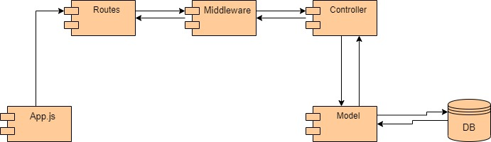

# API REST Electiva II
## Technologies
- Node.js
- Swagger
- Git
- VSCode
- Mongo (Atlas)

## Component diagram

## Schema
## _Book schema description_
Book schema in database
- **Title:**
 type: String
 description: Title od the book.
- **Description:**
type: String
description: Description of the book.
- **Author:**
type: String
description: Author of the book.
- **Cover:**
type: Object
description: Information about the book cover
- **Gender:**
type: String
description: Gender of the book.
- **Editorial:**
type: String
description: Editorial of the book.
- **Deleted:**
type: Boolean
description: State of the book 
- isBorrowed:
type: Boolean
description: Indicate if the book is on loan.
- lendto:
type: schema (LendSchema)
description: basic information of the person who acquired the book

## LendSchema
Lead Schema collection
- **Name:** 
type: string
description: Name of the person to whom a book was loaned
- **CellPhone:**
type: string
description: Cellphone number of the person to whom a book was loaned

For more information check official documentation: 
##### uriBase:
[uriBase/api/docs][df1]
